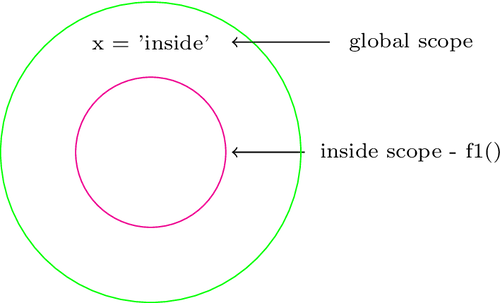
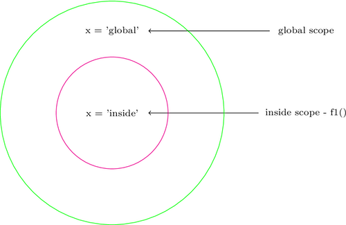
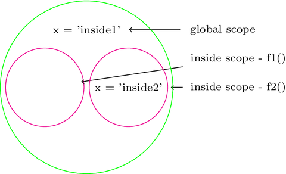
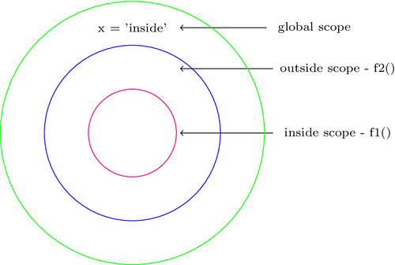

# Function

- [Defining Functions / Function Statement](#defining-functions--function-statement)
- [Scope](#scope)
- [Hoisting](#hoisting-1)
- [Case Sensitive](#case-sensitive-1)
- [Overload](#overload)
- [Recursion](#recursion)
- [Default Parameters](#default-parameters)
- [Destructuring Assignment](#destructuring-assignment)
- [Named Parameters / Keyword Parameters](#named-parameters--keyword-parameters)
- [Arguments Object / es5](#arguments-object--es5)
- [Rest parameters (spread operator) ES6](#rest-parameters-spread-operator-es6)
- [Function Expression / Anonymous Function](#function-expression--anonymous-function)
- [Immediately Invokable Function Expressions (IIFE)](#immediately-invokable-function-expressions-iife)
- [Method / Callback](#method--callback)
- [Closure](#closure)
- [Nested functions and closures](#nested-functions-and-closures)
- [ES6 Arrow Function `=>`](#es6-arrow-function-)
- [Higher-Order Function](#higher-order-function)

## Defining Functions / Function Statement

---

**Diagram:**

<br>
Fonte: [Wikipedia](<https://en.wikipedia.org/wiki/Function_(mathematics)>)

**Code:**

```js
function addition(param1, param2) {
  return param1 + param2;
}

// Calling functions
console.log(addition(1)); //=> NaN
console.log(addition(1, 2)); //=> 3
console.log(addition(1, 2, 3)); //=> 3
```

**Reference:**

- [Function Reference \| MDN](https://developer.mozilla.org/en-US/docs/Web/JavaScript/Reference/Functions)
- [Function Guide \| MDN](https://developer.mozilla.org/en-US/docs/Web/JavaScript/Guide/Functions)

## Scope

---

<!--
TODO Chart scope(nested circles, concentric circles):
- https://javascriptissexy.com/understanding-es2015-in-depth-part-1-block-scope-with-let-and-const/
- https://jsplain.com/javascript/index.php/Thread/110-Encapsulation-in-JavaScript/
- http://techslides.com/understanding-javascript-closures-and-scope
- https://www.latex4technics.com/ (tikz)
-->

### Scope (Global, Inside)

**Example 1**

```js
let x = 'global';

function f1() {
  x = 'inside';
}

console.log(x); //=> 'global'
f1();
console.log(x); //=> 'inside'
```



| Scope  | Hierarchy | Variable       |
| ------ | --------- | -------------- |
| global | g         | `x = 'inside'` |
| inside | g>f1      |                |

**Example 2**

```js
let x = 'global';

function f1() {
  let x = 'inside';
}

console.log(x); //=> 'global'
f1();
console.log(x); //=> 'global'
```



| Scope  | Hierarchy | Variable       |
| ------ | --------- | -------------- |
| global | g         | `x = 'global'` |
| inside | g>f1      | `x = 'inside'` |

### Scope (Global, Inside1, Inside2)

**Example 1**

```js
let x = 'global';

function f1() {
  x = 'inside1';
}

function f2() {
  let x = 'inside2';
  f1();
}

console.log(x); //=> 'global'
f2();
console.log(x); //=> 'inside1'
```



| Scope   | Hierarchy | Variable        |
| ------- | --------- | --------------- |
| global  | g         | `x = 'inside1'` |
| inside1 | g>f1      |                 |
| inside2 | g>f2      | `x = 'inside2'` |

**Example 2**

```js
let x = 'global';

function f1() {
  let x = 'inside1';
}

function f2() {
  let x = 'inside2';
  f1();
}

console.log(x); //=> 'global'
f2();
console.log(x); //=> 'global'
```


| Scope   | Hierarchy | Variable        |
| ------- | --------- | --------------- |
| global  | g         | `x = 'global'`  |
| inside1 | g>f1      | `x = 'inside1'` |
| inside2 | g>f2      | `x = 'inside2'` |

### Scope (Global, Outside, Inside)

**Example 1**

```js
let x = 'global';

function f1() {
  x = 'outside';
  function f2() {
    x = 'inside';
  }
  f2();
}

console.log(x); //=> 'global'
f1();
console.log(x); //=> 'global'
```



| Scope   | Hierarchy | Variable       |
| ------- | --------- | -------------- |
| global  | g         | `x = 'inside'` |
| inside1 | g>f1      |                |
| inside2 | g>f1>f2   |                |

**Example 2**

```js
let x = 'global';

function f1() {
  let x = 'outside';
  function f2() {
    let x = 'inside';
  }
  f2();
}

console.log(x); //=> 'global'
f1();
console.log(x); //=> 'global'
```


| Scope   | Hierarchy | Variable        |
| ------- | --------- | --------------- |
| global  | g         | `x = 'global'`  |
| inside1 | g>f1      | `x = 'outside'` |
| inside2 | g>f1>f2   | `x = 'inside'`  |

## Hoisting

---

```js
console.log(addition(1, 1)); //=> 2

function addition(param1, param2) {
  return param1 + param2;
}
```

## Case Sensitive

---

```js
function addition(param1, param2) {
  return param1 + param2;
}

function Addition(param) {
  return param + 1;
}

console.log(Addition(1)); //=> 2
console.log(Addition(1, 2)); //=> 2
```

## Overload

---

```js
function addition(param1, param2) {
  return param1 + param2;
}

function addition(param) {
  return param + 1;
}

console.log(addition(1)); //=> 2
console.log(addition(1, 2)); //=> 2
```

## Recursion

---

```js
function factorial(n) {
  return n == 0 ? 1 : n * factorial(n - 1);
}

console.log(factorial(4)); //=> 24
```

## Default Parameters

---

```js
function addition(param1, param2 = 0) {
  return param1 + param2;
}

console.log(addition(1)); //=> 1
console.log(addition(1, 2)); //=> 3
```

## Destructuring Assignment

---

```js
function addition(param1, param2, param3, param4) {
  return param1 + param2 + param3 + param4;
}

console.log(addition(...[1, 2, 1, 2])); //=> 6
console.log(addition(...[1, 2], ...[1, 2])); //=> 6
console.log(addition(...[1, 2], 1, ...[2])); //=> 6
console.log(addition(...[1, 2], 1, ...[1, 2])); //=> 5
```

## Named Parameters / Keyword Parameters

---

```js
function addition({ a = 0, b = 0 }) {
  return a + b;
}

console.log(addition({ a: 1, b: 1 })); //=> 2
console.log(addition({ b: 1, a: 1 })); //=> 2
console.log(addition({ b: 1 })); //=> 1
console.log(addition({})); //=> 0
```

## Arguments Object / es5

---

```js
function addition() {
  let summation = 0;
  for (let value of arguments) {
    summation += value;
  }
  return summation;
}

console.log(addition(1)); //=> 1
console.log(addition(1, 1)); //=> 2
console.log(addition(1, 1, 1, 1)); //=> 4
```

## Rest parameters (spread operator) ES6

---

```js
function addition(...params) {
  let summation = 0;
  for (let value of params) {
    summation += value;
  }
  return summation;
}

console.log(addition(1)); //=> 1 ([1])
console.log(addition(1, 1)); //=> 2 ([1, 1])
console.log(addition(1, 1, 1, 1)); //=> 4 ([1, 1, 1, 1])
```

```js
// operator: '+', '*'
function calc(operator, ...params) {
  let result = operator == '+' ? 0 : 1;
  for (let arg of params) {
    result = operator == '+' ? result + arg : result * arg;
  }
  return result;
}

console.log(calc('+', 1)); //=> 1 ('+', [1])
console.log(calc('+', 1, 1)); //=> 2 ('+', [1, 1])
console.log(calc('*', 1, 1, 1)); //=> 1 ('*', [1, 1, 1])
```

## Function Expression / Anonymous Function

---

```js
function(param1, param2){
  return param1 + param2
}
```

```js
const addition = function(param1, param2) {
  return param1 + param2;
};

console.log(addition); //=> [Function: sum]
console.log(addition(1, 2)); //=> 3
```

```js
const addition = function sum(param1, param2) {
  return param1 + param2;
};
console.log(addition); //=> [Function: sum]
console.log(addition(1, 2)); //=> 3
console.log(sum(1, 2)); //  ReferenceError: sum is not defined
```

## Immediately Invokable Function Expressions (IIFE)

---

```js
(function(param1, param2) {
  console.log(param1 + param2);
})(1, 2); //=> 3
```

## Method / Callback

---

```js
let ip = {
  address: '192.168.0.1',
  mask: '255.255.255.0',
  toString: function() {
    return `${this.address}/${this.mask}`;
  },
};

console.log(ip.address); //=> '192.168.0.1'
console.log(ip.toString()); //=> '192.168.0.1/255.255.255.0'
```

## Closure

---

```js
function multiplier(factor) {
  return function(number) {
    return number * factor;
  };
}

let twice = multiplier(2);
console.log(twice(5)); //=> 10
```

## Nested functions and closures

---

```js
function addSquares(a, b) {
  function square(x) {
    return x * x;
  }
  return square(a) + square(b);
}

console.log(squares(2, 3)); // ReferenceError
console.log(addSquares(2, 3)); //=> 13
console.log(addSquares(3, 4)); //=> 25
console.log(addSquares(4, 5)); //=> 41
```

## ES6 Arrow Function `=>`

---

Reference: [doc](https://developer.mozilla.org/en-US/docs/Web/JavaScript/Reference/Functions/Arrow_functions)

<!-- TODO this bind -->

### Syntax

```js
const sum = function(param1, param2) {
  const total = param1 + param2;
  return total;
};
console.log(sum(2, 2)); //=> 4
```

```js
const sum = (param1, param2) => {
  const total = param1 + param2;
  return total;
};
console.log(sum(2, 2)); //=> 4
```

```js
const sum = (param1, param2) => {
  return param1 + param2;
};
console.log(sum(2, 2)); //=> 4
```

```js
const sum = (param1, param2) => param1 + param2;
console.log(sum(2, 2)); //=> 4
```

```js
const sum = (param1, param2) => param1 + param2;
console.log(sum(2, 2)); //=> 4
```

```js
// Line breaks: An arrow function cannot contain a line break between its parameters and its arrow.
const sum = (param1, param2)
                => param1 + param2  //=> SyntaxError: Unexpected token '=>'
console.log(sum(2, 2))
```

```js
const sum = number => number + 1;
console.log(sum(2)); //=> 3
```

```js
const sum = number => number + 1;
console.log(sum(2)); //=> 3
```

```js
const sum = () => 1 + 1;
console.log(sum()); //=> 2
```

### One Expression

```js
const sum = (x, y) => x + y;
console.log([1, 1, 1].reduce(sum)); //=>3
```

```js
const sum = (x, y) => {
  x + y;
};
console.log([1, 1, 1].reduce(sum)); //=> undefined
```

```js
const sum = (x, y) => {
  return x + y;
};
console.log([1, 1, 1].reduce(sum)); //=> 3
```

```js
const sum = (x, y) => {
  z = x + y;
  return z;
};
console.log([1, 1, 1].reduce(sum)); //=> 3
```

```js
const sum = (x, y) => {
  z = x + y;
  return z;
};
console.log([1, 1, 1].reduce(sum)); //=> 3
```

```js
const sum = (x, y) => {
  z = x + y;
  return z;
};
console.log([1, 1, 1].reduce(sum)); //=> 3
```

```js
const sum = (x, y) => (z = x + y);
return z; // SyntaxError: Illegal return statement
console.log([1, 1, 1].reduce(sum));
```

### Returning object literals

```js
const func = () => {
  a: 1;
};
console.log(func); //=> undefined
```

```js
const func = () => { a: 1, b:1 }
console.log(func) //=> SyntaxError: Unexpected token ':'. Parse error.
```

```js
const func = () => ({ a: 1 });
console.log(func); //=> {a: 1}
```

### Callback

```js
const doubleNum = e => e * 2;

function myMap(array) {
  const result = [];
  for (let value of array) result.push(doubleNum(value));
  return result;
}

const array = [1, 2, 3];
console.log(myMap(array)); //=> [2, 4, 6]
```

```js
const doubleNum = e => e * 2;

function myMap(array, callback) {
  const result = [];
  for (let value of array) result.push(callback(value));
  return result;
}

const array = [1, 2, 3];
console.log(myMap(array, doubleNum)); //=> [2, 4, 6]
```

```js
const doubleNum = e => e * 2;

Array.prototype.myMap = function(callback) {
  const array = this;
  const result = [];
  for (let index = 0; index < array.length; index++)
    result.push(callback(array[index], index, array));
  return result;
};

const array = [1, 2, 3];
console.log(array.myMap(doubleNum)); //=> [2, 4, 6]
```

```js
const array = [1, 2, 3];
const doubleNum = e => e * 2;
console.log(array.map(doubleNum)); //=> [2, 4, 6]
```

```js
const array = [1, 2, 3];
const doubleNum = e => e * 2;
console.log(array.map(doubleNum)); //=> [2, 4, 6]
```

```js
const array = [1, 2, 3];
console.log(array.map(e => e * 2)); //=> [2, 4, 6]
```

```js
const array = [1, 2, 3];
console.log(array.map((e, i) => i % 2 == 0)); //=> [true, false, true]
```

### Higher-Order Function

```js
//  http://eloquentjavascript.net/05_higher_order.html#h_xxCc98lOBK
//  Functions that operate on other functions, either by taking them as arguments
//  or by returning them, are called higher-order functions
const animals = [
  { name: 'Waffles', type: 'dog', age: 12 },
  { name: 'Fluffy', type: 'cat', age: 14 },
  { name: 'Spelunky', type: 'dog', age: 4 },
  { name: 'Hank', type: 'dog', age: 11 },
];

let oldDogNames = animals.filter(x => x.age > 10 && x.type === 'dog').map(x => x.name);

console.log(oldDogNames); //=> [ 'Waffles', 'Hank' ]

let totalDogYears = animals
  .filter(x => x.type === 'dog')
  .map(x => x.age)
  .reduce((prev, cur) => prev + cur, 0);

console.log(totalDogYears); //=> 27
```
